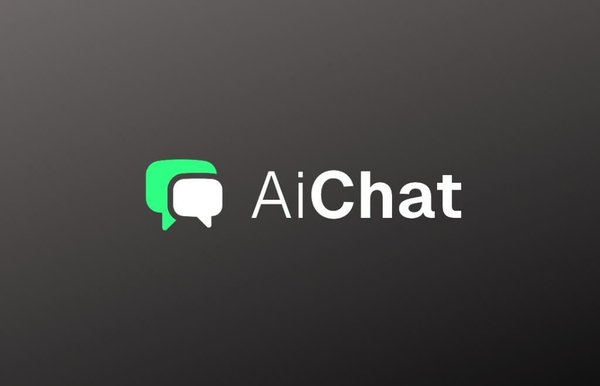
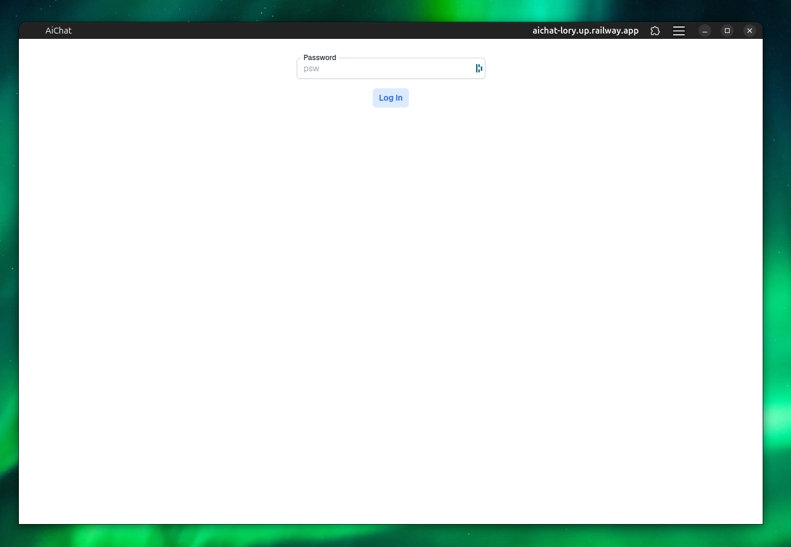
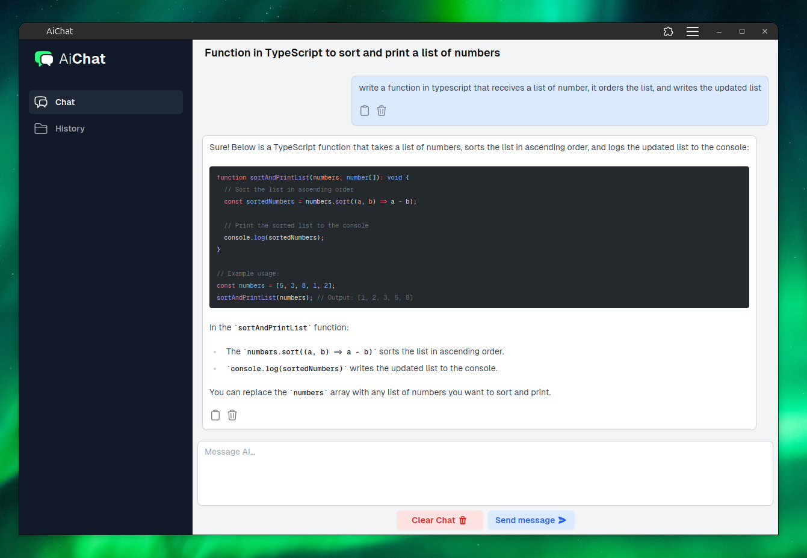
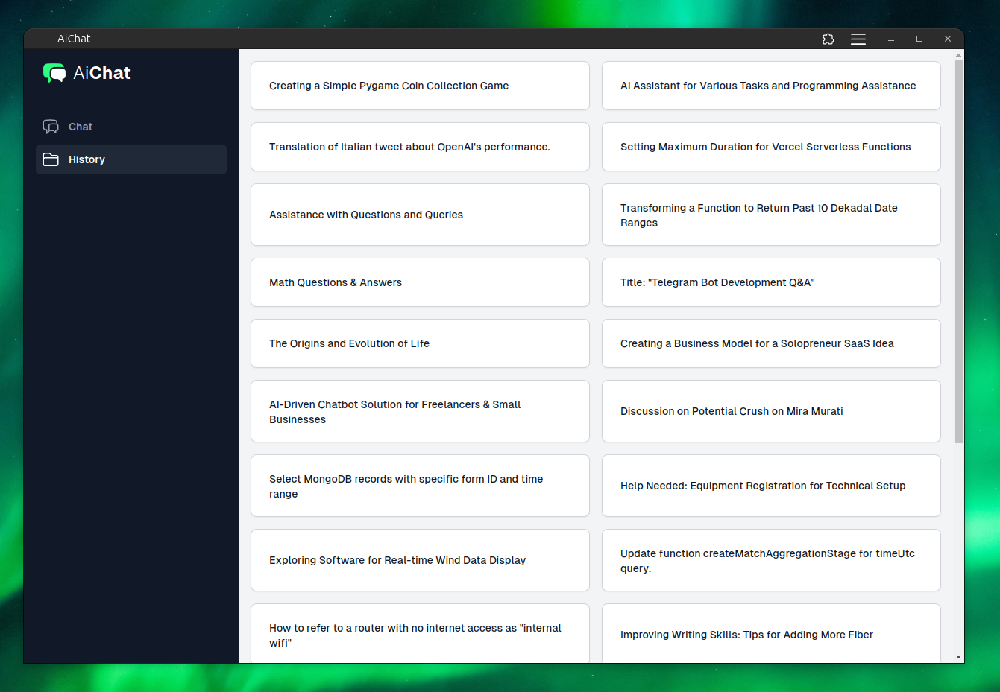

# Ai Chat

A simple UI to interact with various llm backends: openai, groq, fireworksai and togheterai



## What is [**AiChat**](https://github.com/polly3223/AiChat)?

[**AiChat**](https://github.com/polly3223/AiChat) is an open-source chat interface designed to easily test multiple LLMs from the same web app. This tool is particularly useful for developers and researchers who want to compare different language models' outputs in a single, cohesive interface.

## Features

- Supports multiple LLM backends: OpenAI, Groq, FireworksAI, and TogetherAI.
- Chats are automatically saved in the MongoDB database.
- Code snippets generated by the AI are automatically syntax-highlighted based on the detected language.
- User-friendly web interface built with SvelteKit.

## Technology Stack

- **Frontend:** SvelteKit
- **Backend:** Node.js
- **Database:** MongoDB

## Screenshots

### Authentication Page



### Chat UI



### Chat History



## Getting Started

Follow these steps to set up and run [**AiChat**](https://github.com/polly3223/AiChat) on your local machine.

### Prerequisites

1. Node.js and npm (or pnpm)
2. MongoDB server (You can use [MongoDB Atlas](https://www.mongodb.com/) for a free hosted MongoDB instance)

### Installation

1. **Clone the repository:**

   ```sh
   git clone https://github.com/polly3223/AiChat
   cd AiChat
   ```

2. **Create a `.env` file at the root of the project with the following structure:**

   ```
   SECRET_MONGO_CONNECTION=mongodb+srvXXXXXXXXXXX
   SECRET_PSW=XXXXXXXXXXX

   SECRET_TOGHETERAI_API_KEY=XXXXXXXXXXX
   SECRET_GROQ_API_KEY=XXXXXXXXXXX
   SECRET_FIREWORKS_API_KEY=XXXXXXXXXXX
   SECRET_OPENAI_API_KEY=XXXXXXXXXXX
   ```

   > The MongoDB connection string, a password, and at least one API token from one of the AI service providers are required.

3. **Set up the AI client:**
   Based on the API service you want to use, go to the file `aiAdapter.ts` and uncomment its relative line:

   ```typescript
   // export const aiClient: AiClient = new GroqClient();
   // export const aiClient: AiClient = new ToghetherAiClient();
   // export const aiClient: AiClient = new FireworksAiClient();
   export const aiClient: AiClient = new OpenAiClient();
   ```

4. **Install the dependencies:**

   ```sh
   pnpm install
   ```

5. **Run the project:**
   ```sh
   pnpm dev
   ```

## Deployment

### Deploy on [**Railway**](https://railway.app/)

1. **Fork the repository:** This allows you to make changes easily.
2. **Login to Railway and select the forked repository from your GitHub:**
3. **Insert the environment variables from the Railway UI and run the automatic build:**

You can also choose to deploy the project on your own VPS following similar steps by configuring your server and setting the environment variables.

## Contributing

Contributions are welcome! If you have any ideas or improvements, feel free to open a pull request or raise an issue.

## Future Plans

There is no clear roadmap as of now. We welcome ideas and suggestions from the community to help shape the future of [**AiChat**](https://github.com/polly3223/AiChat).

## License

This project is licensed under the MIT License.
